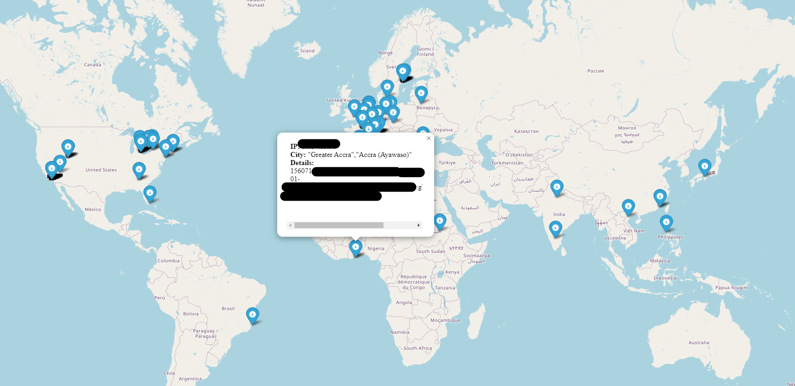

# 🌍 BlackHatMap.py

[](https://github.com/pentestfunctions/attack-map/stargazers)
[](https://github.com/pentestfunctions/attack-map/network)
[](https://github.com/pentestfunctions/attack-map/issues)
[](https://python.org)

BlackHatMap.py is a Python tool designed for visualizing geolocation data of IP addresses related to cybersecurity threats. It utilizes data from various sources to map the geographic locations of potentially malicious IP addresses.

- Provided is a ip_map.html previously generated based on the CardingMafia.csv database using the all time abuseipdb database. 

<p align="center">
  
</p>

## 📚 Description

The tool works by combining data from the `abuseipdb` database and the `dbip-city` file to plot IP addresses on an interactive map. IPs flagged for abuse are checked against geolocation data to display their origins visually using Folium maps.

## 🚀 Getting Started

### Prerequisites

- Python 3.x
- Folium
- IntervalTree
- IPaddress

### Installation

1. Clone the repository:
   ```sh
   git clone https://github.com/pentestfunctions/attack-map.git
   ```
2. Install dependencies:
   ```sh
   pip install folium intervaltree ipaddress
   ```

## Usage
Run `blackhatmap.py` with the required database files. Ensure you have the following files in your directory:

[AbuseIPDB Blocklist](https://github.com/borestad/blocklist-abuseipdb)
[DBIP-Country CSV](https://cdn.jsdelivr.net/npm/@ip-location-db/dbip-country/dbip-country-ipv4.csv)


#### Database Structure
- abuseipdb: Contains known abuse IPs, one IP per line.
- dbip-city: Contains IP ranges and their associated GPS coordinates.


## 🛠️ Example
Here's how to use the IPAnalyzer class:
   ```sh
   ip_analyzer = IPAnalyzer('your_database.csv', 'abuseipdb_file.csv', 'dbip_city_file.csv')
   matched_ips = ip_analyzer.find_and_match_ips()
   ip_analyzer.create_map(matched_ips)
   ```
